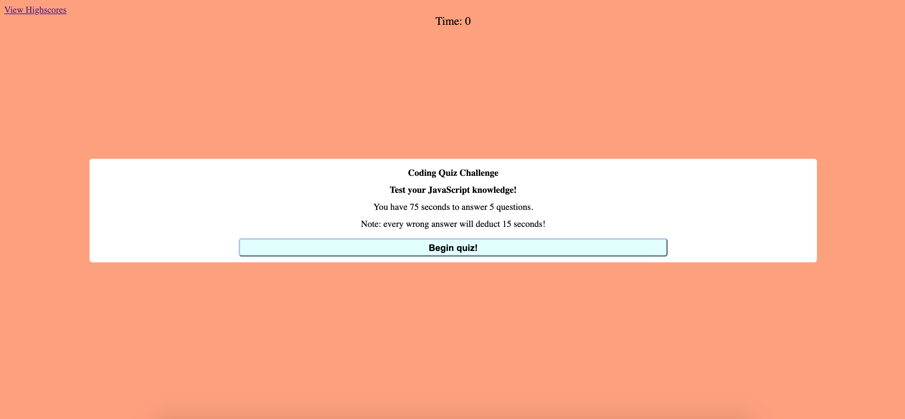

This is a simple 5 question quiz. When the start button is pressed, each question will appear, and the timer will start. The user will have 75 seconds to answer 5 questions. However, when the incorrect answer is selected, 15 seconds will be deducted. Once the timer hits zero or all the questions have been answered, the user will be able to see the score and input initials to be saved in the High scores page.
The high scores page pulls from the local storage data. The initials and scores saved in local storage will be visible on this page. 

[Code Quiz](https://sbhwang23.github.io/Homework04/)

